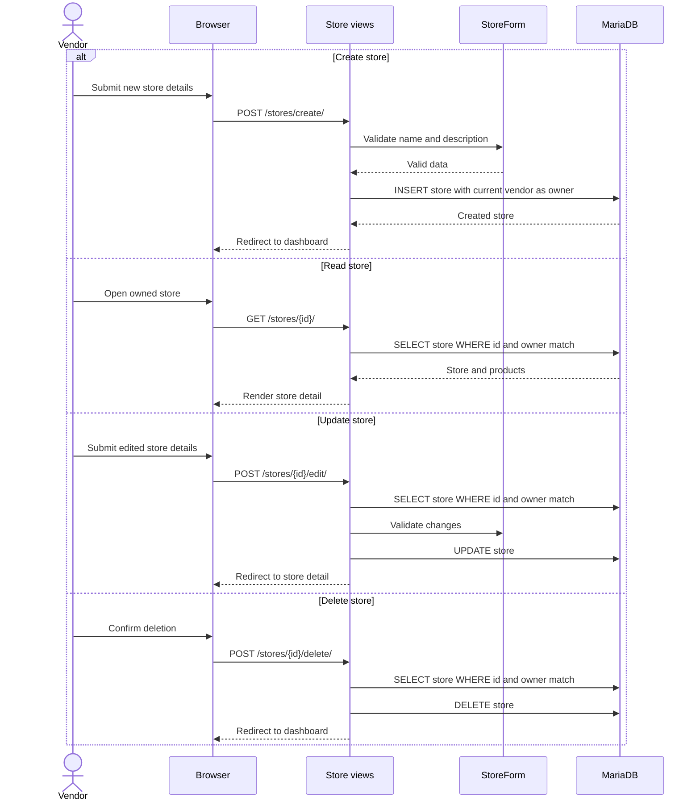
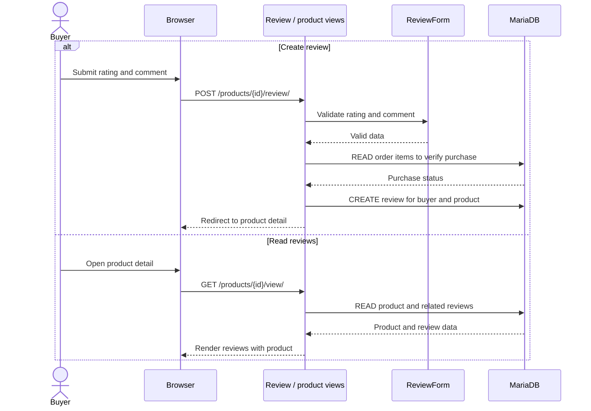

# Store, Buyer, and Review Sequence Diagrams

These diagrams describe the eCommerce application's own interactions. They replace the unrelated external-post sequence previously used.

## Store CRUD sequence (vendor)



## Buyer use-case sequence

```mermaid
sequenceDiagram
    actor Buyer
    participant Browser
    participant Auth as Authentication / buyer views
    participant Cart as Session cart
    participant DB as MariaDB

    Buyer->>Browser: Register as Buyer
    Browser->>Auth: POST /register/
    Auth->>DB: CREATE user and add Buyer group
    DB-->>Auth: Buyer account created
    Auth-->>Browser: Sign in and redirect home
    Buyer->>Browser: Browse stores and products
    Browser->>Auth: GET /stores/ or /browse/
    Auth->>DB: READ available stores/products
    DB-->>Auth: Store/product data
    Auth-->>Browser: Render catalogue
    Buyer->>Browser: Add or change cart item
    Browser->>Auth: Request add/increase/decrease/remove
    Auth->>Cart: CREATE/UPDATE/DELETE session cart entry
    Cart-->>Browser: Updated cart
    Buyer->>Browser: Confirm checkout
    Browser->>Auth: POST /checkout/
    Auth->>DB: CREATE order and order items; UPDATE stock
    DB-->>Auth: Order committed
    Auth->>Cart: CLEAR cart
    Auth-->>Browser: Render order confirmation
```

## Review create and read sequence (buyer)



The current application exposes review creation and reading. Review update and delete endpoints are not implemented, so the diagram deliberately does not claim that those operations exist.
